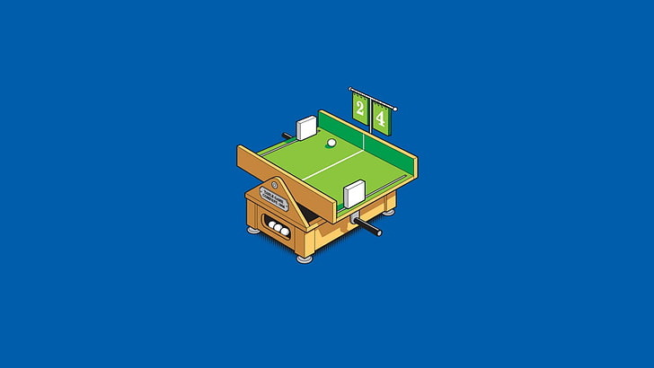

# PING PONG

## Contents

1. [Pong.c](#pongc)
2. [Pong_step_by_step.c](#pong_step_by_stepc)

# pong.c
Ping pong с использованием библиотеки [ncurses](https://www.opennet.ru/docs/RUS/lfs5/appendixa/ncurses.html).

* ***Управление:***

***A/Z и K/M для перемещения ракеток.***

* ***Графика***

***Поле — прямоугольник 80 на 25 символов.***

***Размер ракетки — 3 символа.***

***размер мяча — 1 символ.***

* ***UI/UX***

***После достижения одним из игроков счета в 24 очка, игра выводит поздравление победителя и завершается.==***

# pong_step_by_step.c
Ping pong только по шагам
* ***Управление:***

***A/Z и K/M для перемещения ракеток, потом Enter***

***Space Bar для пропуска действия на очередном шаге игры в пошаговом режиме.***
