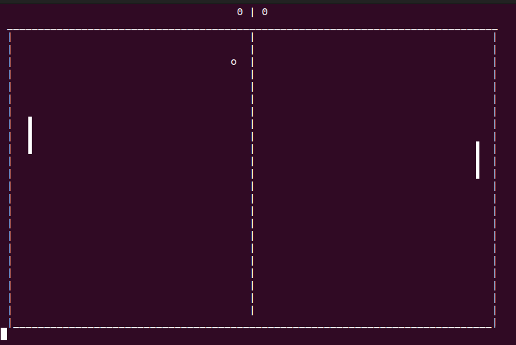

# PING PONG

# Содержание
<!-- TOC -->
1. [Об игре](#об-игре)
2. [Файлы](#файлы)
3. [Скрин](#скрин)
<!-- TOC -->

# Об игре
Ping pong с использованием библиотек [ncurses](https://www.opennet.ru/docs/RUS/lfs5/appendixa/ncurses.html) и [thread](https://en.cppreference.com/w/cpp/thread/thread).

* **Управление:**

A/Z и K/M для перемещения ракеток.

* **Графика**

Поле — прямоугольник 80 на 25 символов.

Размер ракетки — 3 символа.

размер мяча — 1 символ.

* **UI/UX**

После достижения одним из игроков счета в 24 очка, игра выводит поздравление победителя и завершается.

# Файлы
* **pong.cpp**

Создает три потока: чтения с клавиатуры, перемещения мячика и отрисовки поля. Здесь можно настроить размер поля, скорость игры и т.д.
* **classes.h/classes.cpp**

Основные элементы игры и их логика. Здесь можно настроить смещение ракеток от края поля, скорость мяча и т.д.

# Скрин
